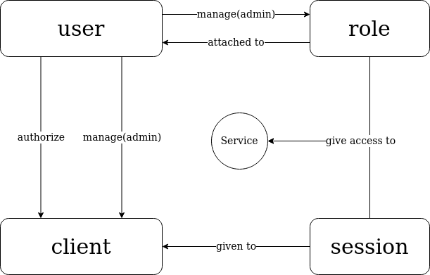

# Central Auth Service

provides client/user authentication/registration/management, ABAC authorization and session management.

# Author

[onichandame](https://github.com/onichandame)

# Environment Setup

Requires MongoDB. IP of Mongo instance can be passed in `MONGO_ADDR` env variable

Requires NATS. IP of NATS instance can be passed in `NATS_ADDR` env variable.

# Usage

```bash
yarn && yarn start
```

# Design

The entities that are needed in this service are:

1. user
2. role
3. client
4. session
5. service

The relation between these entities are shown below:



Each entity will be explained in the following subsections.

## Service

The keystone of the architecture is services. Each service provides a well-defined functionality, such as data CRUD, remote logging, etc.

This service itself is a service in the diagram that provides access control.

Only the superadmin is able to modify the service information.

## Client

The app that initiates the request on behalf of the actual user. Usually a frontend. Only the superadmin can manage client info.

## User

The human who directly interacts with the client. A user may have roles attached.

## Role

A role is a collection of permissions that the user with this role has. A role may be give the permission to manage other roles.

## Session

A session is given to each successful authorization. The client ID and the user ID are serialized into the token. For each request from the client, the session needs to be varified with the central auth server.
